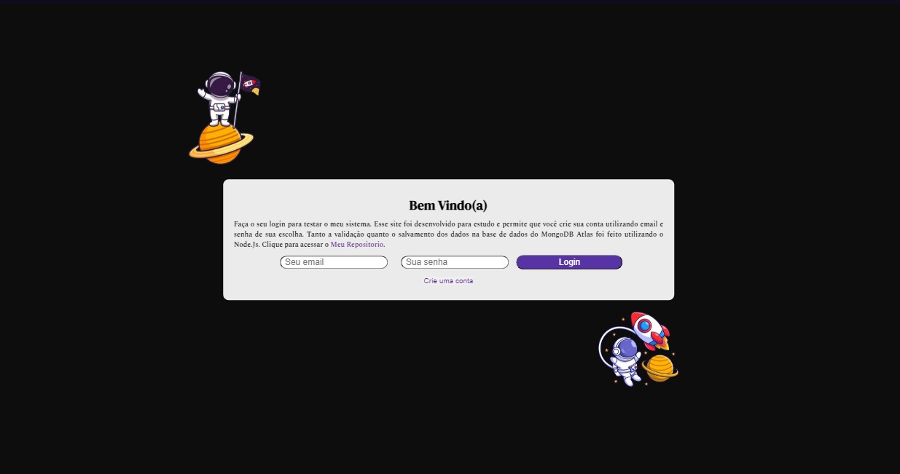
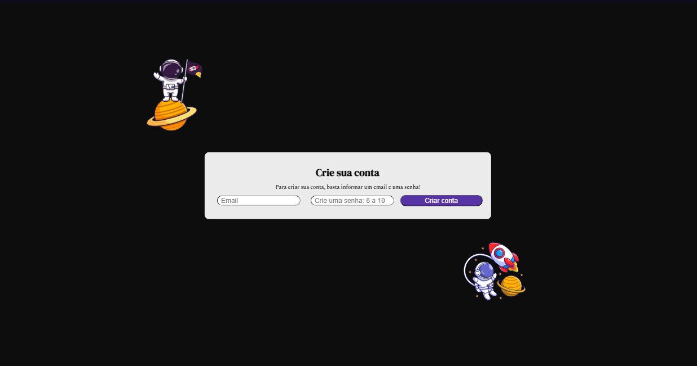

# Functional login screen using Node.Js
 <br>
 .
 ### Demo App: not avaiable yet
# About
 This is a simple functional login screen that can be used in many websites.
 This application consists in a login screen that you can use fictional emails and passwords.
 You can create your own account using the "Create User" page.
 A successful login redirects you to a success login page, and a unsuccessful login redirects you to a unsuccess login page.
 
 .
# Used Tecnologies
 ### Back-end
 - JavaScript
 - Node.js
 - Express
 - MongoDB Atlas

 ### Front-end
 - HTML
 - CSS

 ### Implantation
 - Not Started

# How to execute the project
 ### Prerequisites
 - Node.js installed
 - Git installed
 ### Step by step
 ```bash
 # clone repository
 git clone https://github.com/nicolaskleinaraujo/node-login

 # enter "src" folder
 cd node-login\src

 # run the "server.js"
 node server.js
 ```
# Author
 Nicolas Klein Faria de Araujo <br>
 https://nicolaskleinaraujo.github.io/portfolio/src/
